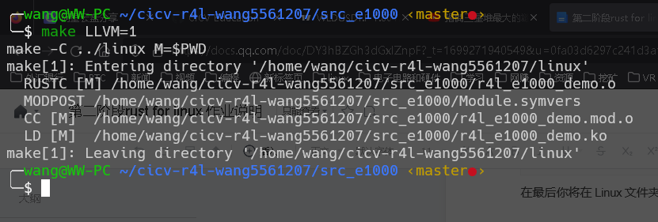
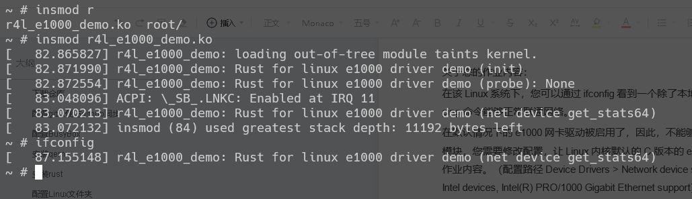
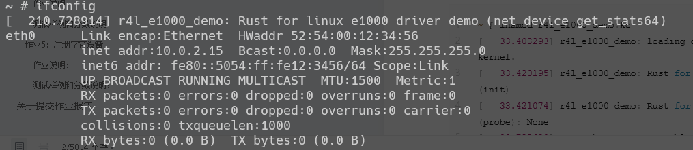
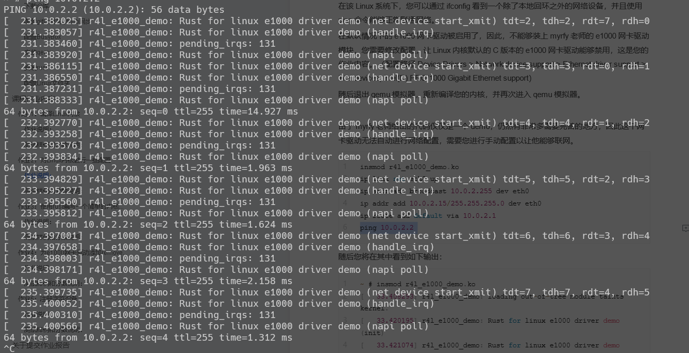

<p align="center">
  <h1 align="center">第二阶段 rust for linux 课程作业</h1>
  <h3 align="left">实验环境:wsl2+Ubuntu22.04</h3>
  <h3 align="right">王伟</h3>
</p>


## 索引

- [索引](#索引)
- [作业1-编译Linux内核](#作业1-编译linux内核)
- [作业2-重新编译Linux内核并加载Rust网卡驱动](#作业2-重新编译Linux内核并加载Rust网卡驱动)
- [作业3-使用rust编写一个简单的内核模块并运行](#作业3-使用rust编写一个简单的内核模块并运行)
- [作业4-为e1000网卡驱动添加remove代码](#作业4-为e1000网卡驱动添加remove代码)
- [作业5-注册字符设备](#作业5-注册字符设备)
- [结语](#结语)


## 作业1-编译Linux内核

### 实验内容:

#### 1、设置编译内核架构:
```bash
cd linux
make x86_64_defconfig
```
- 生成适用于x86_64架构的默认配置


#### 2、设置内核支持Rust:

```bash
make LLVM=1 menuconfig
General setup
        ---> [*] Rust support
```


#### 3、进行内核编译:

```bash
make LLVM=1 -j$(nproc)
ls vmlinux
```


## 作业2-重新编译Linux内核并加载Rust网卡驱动

+ 问题1、编译成内核模块，是在哪个文件中以哪条语句定义的？

```bash
答：Kbuild文件里的obj-m := r4l_e1000_demo.o
```
+ 问题2、该模块位于独立的文件夹内，却能编译成Linux内核模块，这叫做out-of-tree module，请分析它是如何与内核代码产生联系的？

```bash
答：Makefile里通过make的-C选项把当前工作目录转移到了linux目录下，内核的构建系统通过M=$$PWD 来定位独立模块的源代码，从而实现驱动的编译
```

### 实验内容:


#### 1、编译网卡模块:

```bash
make LLVM=1
```




#### 2、手动编译qemu7.25后运行脚本报错:


##### 解决方案：

```
由于新版中slirp被移除,编译时需要手动开启

sudo apt-get install libslirp-dev 

../configure --target-list=x86_64-softmmu --enable-slirp
```

#### 3、重新编译Linux内核取消C驱动支持:

```bash
make LLVM=1 menuconfig

Device Drivers 
    ---> Network device support
        ---> Ethernet driver support
            ---> Intel devices, Intel(R) PRO/1000 Gigabit Ethernet support
```


#### 4、加载rust驱动、配置网络、完成PING:

```bash
insmod r4l_e1000_demo.ko
ip link set eth0 up
ip addr add broadcast 10.0.2.255 dev eth0
ip addr add 10.0.2.15/255.255.255.0 dev eth0
ip route add default via 10.0.2.1
ping 10.0.2.2
```





## 作业3-使用rust编写一个简单的内核模块并运行


## 作业4-为e1000网卡驱动添加remove代码


## 作业5-注册字符设备


## 结语
