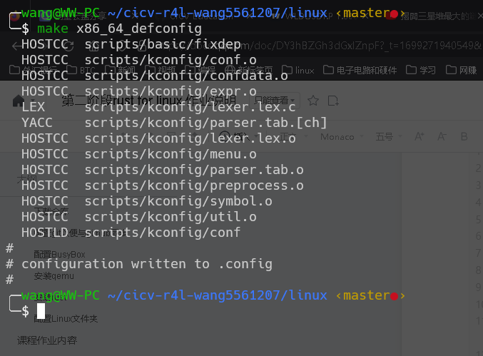
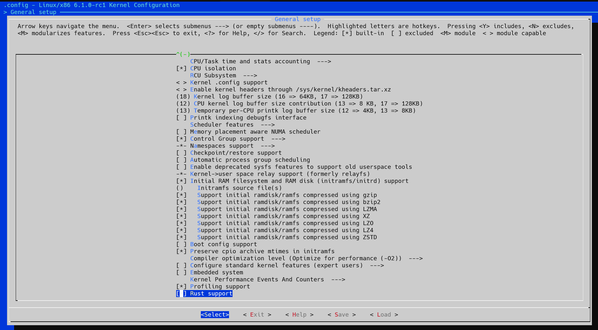
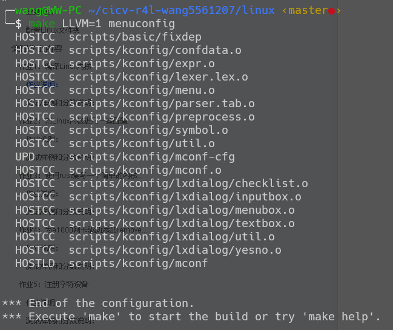
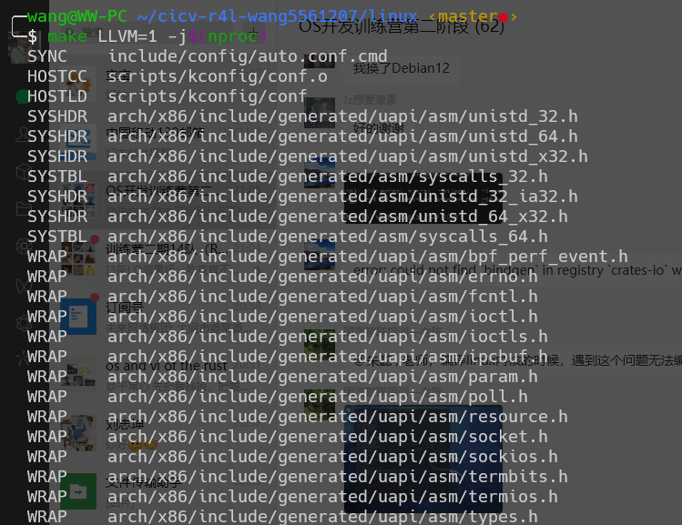

#<center>第二阶段rust for linux课程作业

-----------------------------------------
#<h2 id="1">[作业1](#index)</h2>
<p><h3>实验内容:</h3></p>

<p><h4>1、设置编译内核架构:</h4></p>


<p><h4>2、设置内核支持Rust:</h4></p>
<p></p>


<p><h4>3、进行内核编译:</h4></p>


------------------------------------

#<h2 id="2">[作业2](#index)</h2>

<p><h3>1、编译成内核模块，是在哪个文件中以哪条语句定义的？</h3></p>

<p><h3>2、该模块位于独立的文件夹内，却能编译成Linux内核模块，这叫做out-of-tree module，请分析它是如何与内核代码产生联系的？</h3></p>

<p><h3>实验内容：</h3></p>

```
原因:旧版qemu包含slirp，而新版被移除了
sudo apt-get install libslirp-dev
../configure --target-list=x86_64-softmmu --enable-slirp

```

<h2 id="3">作业3</h2>
<p>......</p>

<h2 id="4">第二段内容</h2>
<p>......</p>

<h2 id="5">第二段内容</h2>
<p>......</p>
