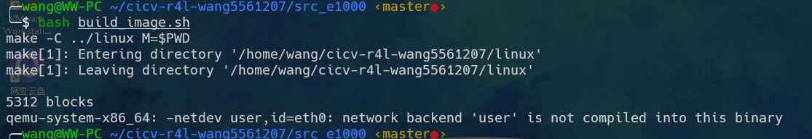

# <center id="index">第二阶段rust for linux课程作业</center>

## 实验环境:wsl2+Ubuntu22.04

## [作业1](#index)

### 实验内容:

#### 1、设置编译内核架构:


#### 2、设置内核支持Rust:


#### 3、进行内核编译:


## <h2 id="2">[作业2](#index)</h2>

### 1、编译成内核模块，是在哪个文件中以哪条语句定义的？

### 2、该模块位于独立的文件夹内，却能编译成Linux内核模块，这叫做out-of-tree module，请分析它是如何与内核代码产生联系的?

### 实验内容:

#### 1、手动编译qemu7.25后运行脚本报错:</h4></p>
```
test
test
test

```



<p><h3>解决方案：</h3></p>

```
由于新版中slirp被移除,编译时需要手动开启

sudo apt-get install libslirp-dev 

../configure --target-list=x86_64-softmmu --enable-slirp
```

<h2 id="3">作业3</h2>
<p>......</p>

<h2 id="4">第二段内容</h2>
<p>......</p>

<h2 id="5">第二段内容</h2>
<p>......</p>
